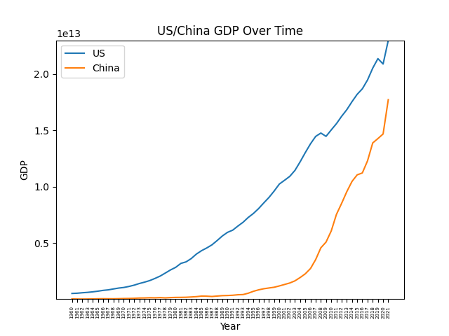
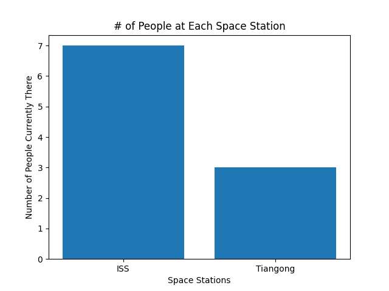

# [Project 2](https://github.com/mikeizbicki/cmc-csci040/tree/2022fall/project_02) for CM-CSCI 40.
## Comparing the US and China's GDP

This is a line chart displaying the relationship between the US and China's GDPs from 1960 to the present. You can see that although the US has remained consistently higher, China's GDP is growing at a faster rate. 

The dataset I used can be found [here (US)](http://api.worldbank.org/countries/USA/indicators/NY.GDP.MKTP.CD?per_page=5000&format=json) and [here (China)](http://api.worldbank.org/countries/CHN/indicators/NY.GDP.MKTP.CD?per_page=5000&format=json).

## Where in Space?

This bar chart displays how many people are currently in space, and it is sorted by which space station these people are located. Currently, there are only two manned space stations, so the chart isn't too exciting to look at. There is a total of 10.

The dataset I used can be found [here](http://api.open-notify.org/astros.json).